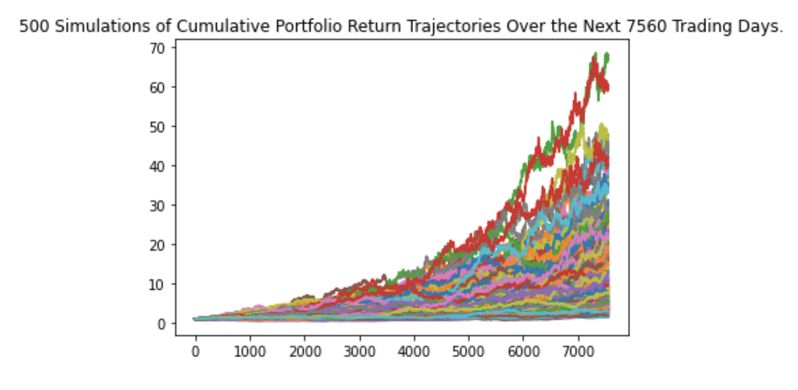

# Retirement Planning

The financial_planning_tools notebook uses a variety of libraries and apis such as the alpaca api to create an accurate simulation to help predict the range someone's retirement investment might return. The MCForecastTools.py file includes the MCSimulation class that was used to create the Monte Carlo simulations.

---

## Technologies

Python 3.9

* [pandas](https://pandas.pydata.org/docs/getting_started/overview.html) 
* [pathlib](https://docs.python.org/3/library/pathlib.html) 
* [numpy](https://numpy.org/doc/stable/user/absolute_beginners.html)
* [alpaca_trade_api](https://github.com/alpacahq/alpaca-trade-api-python) 
* [requests](https://www.w3schools.com/python/module_requests.asp) 
* [json](https://pypi.org/project/jsonlib/)
* [dotenv](https://pypi.org/project/python-dotenv/)
* [datetime](https://docs.python.org/3/library/datetime.html)

---

## Installation Guide

```python
  pip install pandas
  pip install pathlib
  pip install numpy
  pip install alpaca_trade_api
  pip install json
  pip install datetime
```

---

## Usage

The notebook is great for looking at the outcomes of portfolios using a distrubution strategy. The illistration below are the the outcomes of a 60% SPY and 40% AGG portfolio for the next 30 years from the current trading date.(April 27, 2022 for the simulation. **Will use the last trading day**) The Y value is how many times the portfolio will multiply in price. The X value is how many trading days have past. This is not finacial advice and should not be used for a retirement plan.



---

## Contributors

Main contributer **Santiago Hernandez**
- [dsmannight@gmail.com](dsmannight@gmail.com)

---

## License

This application is free for non-profit use.
